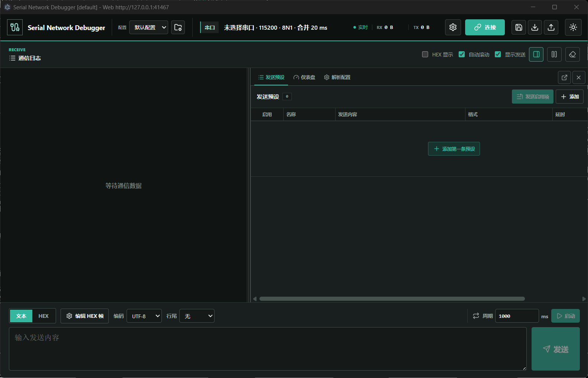

# Serial Network Debugger

> 本项目由 **OpenAI Codex** 生成。



## 开发状态

> [!WARNING]
> 本项目仍处于开发阶段，当前功能尚未经过充分的长期运行、异常恢复和多平台硬件兼容性验证，可能存在通信错误、数据丢失、界面异常或配置损坏等问题。请勿将其用于生产环境、安全关键设备或其他无法承受错误收发的场景。

使用真实串口或网络设备前，请先在非关键测试环境中核对通信参数和实际收发数据，并自行记录重要配置。升级版本后也应重新验证关键通信流程，不应仅依赖界面显示判断设备状态。

一个跨平台的串口与网络调试工具。Node.js + TypeScript 负责本机串口、Socket、HTTP 和 WebSocket，Vue 3 浏览器界面负责连接配置、数据发送与实时日志显示。

后续开发者或 AI 工具接手前，请依次阅读 [AGENTS.md](AGENTS.md)、[文档索引](docs/README.md) 和 [AI 开发指南](docs/AI-development-guide.md)。其中记录了强制 Git 工作流、当前架构、关键数据流、跨层同步点、验证要求和不可破坏的行为约束。日期命名的交接文档只作为历史快照保留。

## 当前功能

- 串口枚举、连接、收发，支持波特率、数据位、校验位、停止位和接收合并间隔配置
- TCP Client 连接、双向收发和断线状态通知
- TCP Client 可选掉线自动重连，远端服务恢复后每 3 秒自动尝试重新建立连接
- TCP Server 监听多个客户端，接收数据并向所有客户端广播
- UDP 本地绑定、固定远端发送，或自动回复最近的数据来源
- 文本与 HEX 数据收发，支持 UTF-8、ASCII、GBK 和 CR/LF 行尾
- HEX 发送支持自由组合帧字段，可重复添加并任意排序帧头、序号、功能码、长度、数据、CRC16 和帧尾
- 自定义生成支持 UInt、Int、Float32、Float64、BCD 滑块，以及按位、按字节和枚举快速控件
- 后端周期自动发送，支持 10 ms 至 24 小时间隔、启动后立即发送、累计次数和多页面状态同步
- 发送预设的新增、编辑、删除、载入与一键发送，每条 HEX 预设可独立保存自由组合的帧格式
- 发送预设支持拖拽排序和单条复制，复制后的预设与 HEX 帧配置使用独立标识
- 支持创建、复制、重命名、删除和切换全局配置，每组配置独立保存通信参数、发送区内容、HEX 帧配置和发送预设
- 可随时按 `Ctrl+S`（macOS 为 `Command+S`）保存当前未提交的发送预设、通信参数和项目配置，并可将全部配置导出为 JSON 后在另一浏览器或电脑导入
- 接收帧解析支持按固定字节筛选 RX 帧，并按起始偏移和字节长度切片提取 UInt、Int、Float32/64、BCD、状态位、HEX 与 ASCII 字段
- 解析数值支持大小端、倍率、偏移、小数位和单位换算，每个字段可自由选择数值卡片、半圆仪表、趋势曲线、进度条或状态指示
- 接收日志固定显示在左侧，右侧工具面板可在发送预设、实时仪表盘和解析配置三个紧凑选项卡之间切换，底部发送区始终可用
- 接收日志与右侧工具面板之间可拖动调整宽度，发送预设的启用、名称、发送内容、格式、延时和操作列也可分别调整列宽
- 发送预设、实时仪表盘和解析配置均可拆分到独立窗口；浏览器版使用同源弹出窗口，Electron 使用原生子窗口
- WebSocket 实时日志、收发字节统计、暂停显示、自动滚动和发送日志显隐
- 顶部通信工具栏集中显示当前参数，通过齿轮弹窗配置四种通信模式
- 通信连接或 TCP Client 自动重连期间仍可修改通信设置；当前参数变化后会自动停止旧会话并按新参数重新连接，同时在右下角提示结果
- 支持浅色/深色主题，并在浏览器中记住最近选择的主题和四种通信模式参数
- 浏览器最多保留 5,000 条日志，批量渲染并保持发送区固定可见

最多 20 组全局配置，以及每组配置中的通信设置、发送区内容、HEX 帧配置、接收解析配置和最多 100 条发送预设，都保存在当前浏览器或 Electron profile 的本地存储中。刷新或重新打开页面后会恢复上次选择的配置及其内容，但不会自动建立连接。旧版本保存的数据会自动作为“默认配置”继续使用。不同浏览器、不同系统用户或不同电脑的数据彼此独立，当前没有云同步。

顶部“配置”选择器用于切换当前全局配置。通信已连接、TCP Client 正在自动重连或周期发送运行期间不能切换配置，需先停止相应任务。复制全局配置会同时复制其全部发送预设，但会为预设和 HEX 帧生成新标识，后续修改与帧序号状态互不影响；当前使用的配置不能直接删除。

顶部保存按钮与 `Ctrl+S`（macOS 为 `Command+S`）会立即保存当前页面中尚未失焦或尚未点“应用”的有效草稿，包括配置名称、通信设置弹窗、发送区、主 HEX 帧、全部发送预设及 RX 解析设置。草稿校验失败时会保留当前编辑状态并提示错误，不会显示保存成功。

通信设置弹窗在已连接或 TCP Client 正在自动重连时仍可编辑。点击“应用设置”或通过全局保存提交草稿后，页面会比较规范化后的当前模式参数：没有变化时保持现有连接；检测到模式、地址、端口、串口参数或其他当前模式参数变化时，通过同一个 `/api/connect` 流程停止旧 transport 并按新参数连接。结果会显示在右下角；如果新连接失败，新配置仍会保存，当前通信则保持断开。重新连接会按现有规则停止正在运行的周期发送。

顶部导出按钮会先保存当前草稿，再把全部全局配置、当前配置 ID 和主题写入带版本号的 JSON 文件。每组配置包括元数据、四种通信模式参数、发送区、主 HEX 帧、全部发送预设及每条预设的独立 HEX 帧、RX 解析字段和仪表盘显示设置。导入会先完整校验文件并要求确认，然后替换当前全部配置；写入失败时会尝试恢复导入前的数据，成功后主窗口和所有拆分窗口会重新加载。通信已连接、TCP Client 正在重连或周期发送运行期间禁止导入，需先停止相应任务。配置文件最大为 32 MiB。

仓库提供一份可直接导入的 [BLE AT 指令示例配置](examples/ble-at-command-config-v1.json)，包含查询、模式切换、广播、扫描、连接参数和低功耗等 57 条 ASCII/CRLF 发送预设。带 `XXXX` 的内容是待修改模板，发送前应替换为设备要求的实际参数。

导出文件不包含当前连接、重连任务、周期发送运行状态、收发日志、字节统计、帧序号会话或趋势曲线点。这些数据仍只存在于运行时；导入配置也不会自动建立连接或恢复发送任务。配置文件可能包含设备地址和业务报文，应按敏感数据妥善保管。

右侧“解析配置”选项卡中的接收帧解析配置也随当前全局配置独立保存。当前版本把每条 RX 记录视为一帧：串口模式下帧边界仍由“接收合并间隔”决定，TCP 是字节流且不天然保留业务帧边界，因此应根据协议合理设置接收合并或在发送端控制分帧；UDP 的每个数据报天然对应一条 RX 记录。固定匹配 HEX 可用于过滤帧头或命令字，字段通过从 0 开始的 Byte 偏移提取。趋势曲线只保留当前页面最近 240 个匹配点，不写入磁盘。

右侧工具标签的“拆分到独立窗口”按钮只会拆出当前标签，其他工具继续留在主窗口。被拆出的标签会暂时从主窗口隐藏；关闭独立窗口后，该标签会自动回到主窗口并恢复为当前标签。浏览器阻止弹出窗口时，需要允许当前站点打开弹出式窗口；Electron 会直接创建同源原生子窗口。各窗口连接到同一个 Node.js 后端，因此共享串口或网络连接及周期发送状态；解析配置、发送预设和发送区内容通过同源本地存储在窗口间同步。每个仪表盘窗口独立保留自己的最近 240 个曲线点，关闭窗口后不会恢复这些临时点。

主窗口中通信日志与工具面板之间的竖向分隔条可以拖动；发送预设表头每个列边界也可以拖动。分隔条获得键盘焦点后可用方向键微调，按住 `Shift` 可加大步长，双击或按 `Home` 恢复对应默认尺寸。面板比例和六个列宽会保存在当前浏览器/Electron profile，并同步到同源独立窗口；这些纯界面偏好不包含在业务配置 JSON 导入导出中。窄屏布局仍自动切换为单面板显示。

HEX 帧配置也保存在当前浏览器中。主发送区打开“编辑 HEX 帧”后，可以从空白配置逐项添加字段，也可以载入“通用变长帧”或“固定命令帧”样例，再继续移动、复制、删除或修改任意字段。定长数据在添加后从右侧属性选择 1、2、3、4 或 8 Byte。每条 HEX 发送预设右侧也有独立的帧配置入口，配置随预设保存；预设组帧编辑器不提供载入样例，需要从当前配置逐项添加或修改字段。

数据字段可选择“自定义生成”来源，并生成 UInt/Int/Float32/Float64/BCD 滑块、按位复选框、按位单选框、按字节开关或枚举控件。Float32 和 Float64 控件分别固定生成 4 Byte 和 8 Byte IEEE 754 数据，并遵循字段字节顺序。控件可设置名称、数值范围、步进精度及字节顺序；运行控件显示在主发送区或对应预设下方，当前值直接参与长度、CRC 和最终发送帧计算。

启用独立 HEX 帧配置的发送预设会在“发送内容”框中只读显示当前完整组包结果。预设可开启“帧变化自动发送”，复选、单选、字节开关和枚举变化后立即发送一次；滑块拖动期间只更新数值和组包预览，松开滑块后才发送。

帧序号仅在发送成功后自增并按字段宽度回绕；发送失败不会跳号。帧长度和 CRC16 都可以按字段范围计算，范围通过字段 ID 记录，因此字段移动后引用仍然有效。CRC16 内置 MODBUS、ARC、CCITT-FALSE、XMODEM、X25、KERMIT，也支持自定义多项式、初始值、结果异或及输入/输出反转。只含固定字段的帧不需要在发送框中填写数据，也可以手动或周期发送。

周期发送由 Node.js 后端调度，不受浏览器后台标签页节流影响。启动时会立即发送一次，之后每次发送完成再等待设定间隔，因此慢速通信不会发生周期任务重叠。切换连接、断开连接、发送失败或关闭服务时会自动停止周期任务。

## 技术结构

项目技术结构如下：

```text
server/src/core/          通信类型、编解码、事件分发和连接管理
server/src/transports/    串口、TCP Client、TCP Server、UDP
server/src/http/          Fastify REST、WebSocket 和静态页面服务
server/src/cli.ts         命令行启动入口
server/test/              Vitest 单元及回环集成测试
server/public/            Vue 生产构建，由 Node.js 直接托管
frontend/src/             Vue 3 + TypeScript 前端源码
desktop/src/main.ts       Electron 窗口和内嵌 Fastify 服务
docs/                     当前 AI 开发指南和历史交接文档
```

浏览器版由独立 Node.js 进程托管 Fastify；Electron 主进程直接复用同一个 `createApp()`，在随机回环端口加载相同的前端、REST、WebSocket 和通信核心。两种形态不存在两套串口或网络实现。

## 环境要求

- Node.js 24 LTS（建议 24.12 或更高的 24.x 版本）
- npm 11
- Windows 10/11、macOS 或主流 Linux 发行版
- Chrome、Edge、Firefox 或 Safari 的近期版本

`serialport` 包含平台原生模块。首次安装时 npm 会获取当前操作系统和 CPU 架构对应的组件，因此 Windows、macOS、Linux 应分别执行安装和构建，不要跨平台复制 `node_modules`。

## 安装

在项目根目录运行：

```powershell
npm install
```

根目录使用 npm workspaces 统一管理前端与服务端依赖，只保留一份 `package-lock.json`。

## 构建与启动

生成 Vue 页面和 Node.js 服务端代码：

```powershell
npm run build
```

启动生产服务：

```powershell
npm start
```

浏览器打开 <http://127.0.0.1:8765>。

## Electron 桌面版

桌面版会在每个 Electron 实例的主进程中启动一套独享的 Node.js 服务和 `TransportManager`。不同命名实例可以同时运行，并分别连接不同串口或网络设备；每个实例的窗口、浏览器扩展页面、日志和周期发送共享该实例自己的后端，不会共享其他实例的运行状态。

开发机直接启动桌面版：

```powershell
npm run desktop
```

默认实例沿用升级前的 Electron 配置目录，Web 服务监听 `127.0.0.1` 的自动分配端口，实际地址显示在窗口标题和启动终端。要同时启动两套完全独立的实例，在两个终端分别运行：

```powershell
npm run desktop -- --instance device-a --web-port 8871
npm run desktop -- --instance device-b --web-port 8872
```

随后可在浏览器分别打开 <http://127.0.0.1:8871> 和 <http://127.0.0.1:8872>。浏览器页面与同端口 Electron 窗口共享通信连接、日志和周期任务，但浏览器与 Electron 的本地配置存储彼此独立，需要时可通过 JSON 导入导出配置。不同 `--instance` 使用不同的 Electron `userData` 目录，因此 Electron 中的主题、全局配置和发送预设也相互隔离；重复启动同一个实例 ID 只会聚焦已有窗口。

桌面版启动参数：

```text
--instance <id>    实例 ID，默认 default，只允许字母、数字、点、下划线和连字符
--web-host <host>  Web 监听地址，默认 127.0.0.1
--web-port <port>  Web 监听端口，0 表示自动分配，默认 0
```

需要让可信局域网中的其他电脑访问某个实例时，可单独开放该实例：

```powershell
npm run desktop -- --instance device-a --web-host 0.0.0.0 --web-port 8871
```

当前 Web 接口没有身份认证。非回环监听只能用于受信任网络，不能暴露到公网，并应通过系统防火墙限制来源地址。

生成无需安装、可直接运行的桌面应用目录：

```powershell
npm run desktop:pack
```

Windows 入口为 `release/win-unpacked/Serial Network Debugger.exe`，整个 `win-unpacked` 目录需要一起保留或分发，不需要运行安装程序。`serialport` 包含原生模块，因此应在目标操作系统上安装依赖并打包；Windows、macOS 和 Linux 的桌面产物不能直接跨平台构建复用。

免安装版或安装版 EXE 使用相同参数，例如：

```powershell
& ".\Serial Network Debugger.exe" --instance device-a --web-port 8871
```

在 Windows 上生成 NSIS EXE 安装包：

```powershell
npm exec electron-builder -- --win nsis --x64
```

安装包生成在 `release/`，文件名包含 [package.json](package.json) 中的版本号。当前没有代码签名，Windows SmartScreen 可能显示未知发布者警告；正式分发应配置可信代码签名证书。`release/` 是本地构建产物，不提交 Git。

macOS 和 Linux 需要在对应系统安装依赖后分别构建，例如：

```bash
npm exec electron-builder -- --mac dmg
npm exec electron-builder -- --linux AppImage
```

不能在 Windows 上构建一次后把同一个 Electron/`serialport` 产物直接用于 macOS 或 Linux。

macOS Finder 通常会复用已运行的应用进程。需要启动另一个命名实例时使用 `open -n`：

```bash
open -n -a "Serial Network Debugger" --args --instance device-b --web-port 8872
```

### GitHub Actions 自动发布

当前软件版本从 `V0.1.0` 开始。仓库中的 [package.json](package.json) 使用不带 `V` 的 `0.1.0`，Git 标签和 GitHub Release 使用带大写 `V` 的 `V0.1.0`。

每次 `main` 更新后，[便携版发布工作流](.github/workflows/portable-release.yml) 会先校验版本、运行测试和类型检查，再使用三个原生 GitHub runner 分别构建：

| 平台 | Release 产物 | 说明 |
| --- | --- | --- |
| Windows x64 | `Serial-Network-Debugger-<version>-windows-x64.exe` | 单文件 portable EXE，无需安装 |
| Linux x64 | `Serial-Network-Debugger-<version>-linux-x86_64.AppImage` | 单文件 AppImage；首次运行前可能需要添加执行权限 |
| macOS Universal | `Serial-Network-Debugger-<version>-macos-universal.dmg` | 同时包含 Intel 和 Apple Silicon 应用的单文件分发镜像 |

三个平台全部成功后，工作流会创建对应版本的 GitHub Release，并上传上述文件和 `SHA256SUMS.txt`。Actions 页面中的临时 Artifact 保留 7 天，Release 附件不会受这个期限影响。也可以在 GitHub 的 `Actions` 页面手动重跑该工作流，但正式发布仍只允许来自 `main`。

各平台构建脚本会显式使用 `--publish never`，只生成并上传 Actions 临时 Artifact，不允许 electron-builder 在构建阶段隐式发布。只有三平台构建全部成功后，最终 `release` 作业才使用 GitHub 自动提供的 `GITHUB_TOKEN` 汇总附件并创建或更新 Release；构建作业不需要也不应配置个人访问令牌。

仓库的 `package-lock.json` 可能只记录生成它的平台所需的 Rollup 原生可选包。为规避 npm 的跨平台 optional dependency 问题，Linux 和 macOS runner 会在 `npm ci` 后显式安装与当前 Rollup 版本一致的平台二进制；不要删除这一步，否则 Windows 上生成的 lockfile 可能导致其他平台在 Vite 构建阶段提示 `Cannot find module @rollup/rollup-*`。

仓库需要允许工作流获得 `contents: write` 权限。如果组织策略禁用了写权限，请在 GitHub 仓库的 `Settings > Actions > General > Workflow permissions` 中允许 GitHub Actions 创建 Release。工作流使用 GitHub 自动提供的 `GITHUB_TOKEN`，不需要在仓库中保存个人令牌。

同一大版本和小版本内，每次准备进入 `main` 的小修改必须把补丁号恰好增加一。应在干净的修改分支开始工作时运行：

```powershell
npm run version:patch
npm run version:check
```

例如 `V0.1.0` 的下一次小修改是 `V0.1.1`，再下一次是 `V0.1.2`。大版本和小版本只能由项目所有者明确指定，AI 或其他开发者不得自行调整。每个版本只能指向一个 `main` 提交；如果同名标签已经属于其他提交，工作流会拒绝覆盖。每次向 `main` 推送应只包含一个待发布版本，功能分支合并时建议整理为单个发布提交。

当前没有 Windows 代码签名或 macOS 签名与公证。Windows SmartScreen 可能提示未知发布者，macOS Gatekeeper 也可能阻止直接运行；正式公开分发前应配置对应平台的签名凭据，并只通过 GitHub Secrets 提供给 Actions。

默认只监听 `127.0.0.1`，局域网内其他电脑无法访问。确需开放访问时：

```powershell
npm start -- --host 0.0.0.0 --port 8765
```

开放到局域网前应配置系统防火墙。当前版本没有身份认证，不应暴露到公网。

## 开发

终端一启动 Node.js 服务端热重载：

```powershell
npm run dev:server
```

终端二启动 Vue 开发服务器：

```powershell
npm run dev:frontend
```

浏览器打开 <http://127.0.0.1:5173>。Vite 会将 `/api` 和 `/ws` 代理到 <http://127.0.0.1:8765>。

## 测试

```powershell
npm test
npm run typecheck
npm run build
```

测试会使用本机回环地址创建临时 TCP/UDP 端点，不访问公网，也不要求真实串口。自动测试涵盖编解码、HEX 自由组帧、配置校验、串口接收合并、TCP/UDP、HTTP、WebSocket 实时事件链路和周期发送调度。

修改前端后必须运行完整构建。Vite 会重建纳入 Git 的 `server/public/index-<hash>.js` 和 `index.html`；不要直接编辑压缩后的哈希文件。

## 串口权限

Windows 通常无需额外配置。Linux 用户需要具有串口设备权限，常见做法是加入 `dialout` 组，然后重新登录：

```bash
sudo usermod -aG dialout "$USER"
```

macOS 串口通常显示为 `/dev/cu.*`。三个平台都不能同时由多个程序独占打开同一串口。

## 当前边界

- 同一服务进程一次只运行一种通信模式。
- TCP Server 发送时广播给全部客户端，暂不支持选择单个客户端。
- UDP 未配置固定远端时，发送目标为最近一个数据报来源。
- 暂停日志只停止页面显示，后端仍正常接收和统计数据。
- 周期发送运行时仍允许手动发送和预设一键发送，后端会将所有发送操作排队执行，避免数据交错。
- 全局配置、发送预设和解析配置只保存在当前浏览器/Electron profile；它们不是服务端账号数据，也不会自动同步到其他电脑。
- 当前没有日志落盘。页面刷新或窗口关闭后，内存日志和趋势曲线点不会恢复。
- 当前没有云同步、用户认证、自动更新和安装包数字签名；配置可通过 JSON 文件手动导入和导出。
- 服务部署到远程服务器时，浏览器操作的是服务器上的串口；要访问当前电脑的本地串口，应在本机运行 Node.js 服务或 Electron 桌面版。
- TCP 是字节流，接收解析当前把每条 RX 日志视为一帧，复杂协议仍需要明确的业务分帧策略。
- 前端复杂拖拽、独立窗口和自动发送交互尚缺少完整浏览器/Electron 端到端自动化测试。

## 故障排查

串口是字节流，本身没有数据包边界。工具默认等待线路持续空闲 20 ms，再把这段时间内连续到达的底层读取块合并成一条 RX 日志。可以在串口配置中调整“接收合并间隔”：间隔过小可能拆成多条，间隔过大则增加显示延迟。

选择 HEX 发送后，界面会自动启用 HEX 显示，避免 `00` 等不可见字节看起来像空内容。

如果 `npm start` 提示找不到 `server/dist/cli.js`，请先运行 `npm run build`。

如果页面已经出现新控件，但 API 返回旧枚举错误（例如 `Invalid option`），通常是 `8765` 端口仍由旧 Node.js 进程监听。停止旧服务、重新执行 `npm run build` 和 `npm start`，再使用 `Ctrl+F5` 强制刷新。`/api/health` 返回成功只说明某个服务在线，不能证明它是刚构建的版本。

如果 Electron 报错 `electron does not provide an export named 'BrowserWindow'`，检查当前终端是否设置了 `ELECTRON_RUN_AS_NODE=1`：

```powershell
Remove-Item Env:ELECTRON_RUN_AS_NODE -ErrorAction SilentlyContinue
npm run desktop
```

Electron 按 `--instance` 使用独立配置目录和实例锁。同名实例重复启动只会聚焦已有窗口；不同实例名可以并行运行，但必须配置互不冲突的固定 Web 端口或使用自动端口。同一个物理串口通常仍只能由一个实例独占打开。
